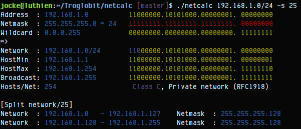

IP network calculator
=====================
[![Travis Status][]][Travis]

netcalc is a slimmed down clone of [sipcalc][], using the output format
of [ipcalc][].  It is written in C and has very few dependencies.  Both
IPv4 and IPv6 are supported.

The original `sipcalc` project was created by Simon Ekstrand in 2001.
It is no longer actively maintained, but has a lot of features and is
available on major Linux distributions and works on *BSD and Solaris.

[Use GitHub][github] to file bug reports, questions, feature requests or
patches — preferably as pull requests.

[ipcalc]:        http://jodies.de/ipcalc
[sipcalc]:       http://www.routemeister.net/
[github]:        https://github.com/troglobit/netcalc
[Travis]:        https://travis-ci.org/troglobit/netcalc
[Travis Status]: https://travis-ci.org/troglobit/netcalc.png?branch=master

<!--
  -- Local Variables:
  -- mode: markdown
  -- End:
  -->
